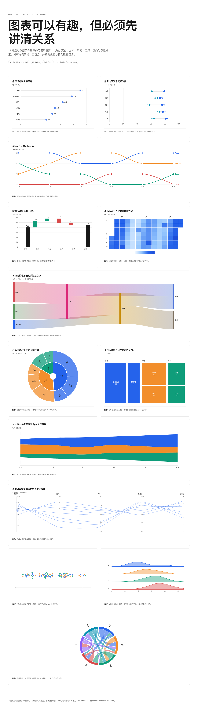

# Qiaomu Chart Report

把文本、Markdown、CSV/JSON、表格和统计结果变成清晰、可核对、可分享的单文件 HTML 报告，同时生成真实浏览器桌面与移动截图。内置固定版本 Apache ECharts 6.1.0 与 D3 7.9.0，以及经过验证的复杂图表 recipes。

```bash
npx skills add joeseesun/qiaomu-chart-report
```



默认网页外壳采用 Vercel / Geist 启发的浅色黑白：白底、近黑正文、中性灰阶、无衬线紧凑排版、细边框、小圆角和克制网格。图表的数据层不受黑白限制，可使用统一的分类色、连续色阶与正负语义色；用户明确指定其他品牌或参考图时仍可覆盖。

它适合一次性分析报告、数据故事、年度/季度统计页和研究专题页。核心区别是：先建立证据与阅读路径，再选图表和视觉系统；不会默认把所有数字塞进 dashboard 卡片。

## 使用示例

你可以直接这样说：

- “把这份 CSV 做成带图表的 HTML 统计报告和桌面、手机截图。”
- “将这篇 Markdown 分析网页化，突出结论与证据。”
- “生成一个自包含 HTML 数据故事，展示年度趋势和关键异常。”
- “把调查结果做成单页网页可视化，并提供全页截图。”
- “用桑基图解释用户来源到转化的流向，再做一个移动端降级版本。”
- “用蜂群图、山脊图比较不同分组的分布，生成 HTML 和截图。”

## 开源图表能力

- 比较与变化：棒棒糖、哑铃、排名变化、瀑布
- 分布：蜂群、山脊，以及选择矩阵中的小提琴、雨云、hexbin
- 时间与节奏：日历热力、主题河流、周期图
- 层级与流向：矩形树、旭日、桑基、弦图
- 多维：平行坐标、散点矩阵、密度等高线

默认用 ECharts；只有弦图、蜂群、山脊等特殊布局才加载 D3。完整选择条件、反例和移动端降级见 `references/open-source-chart-system.md`。

默认样式基准位于 `assets/styles/vercel-monochrome.css`，完整视觉边界见 `references/vercel-monochrome-style.md`。

图库回归：`reports/chart-gallery.html`、`chart-gallery-desktop.png`、`chart-gallery-mobile.png`。图库包含 13 个实际运行的图表，不只是静态清单。

## 输出

- `report-plan.md`：受众、结论、口径、章节、图表和响应式计划
- `report.html`：默认离线、自包含的语义 HTML
- `report-desktop.png`：默认 1440×900 full-page
- `report-mobile.png`：默认 390×844 full-page
- `audit.json`：结构、资源边界和基础可访问性审计

## 本地验证

```bash
python3 /path/to/qiaomu-meta-skill/scripts/validate_skill.py .
python3 scripts/verify_vendor.py --json-output reports/vendor-integrity.json
python3 scripts/embed_chart_lib.py evals/fixtures/chart-gallery.template.html reports/chart-gallery.html --libraries echarts,d3
python3 scripts/audit_report.py evals/fixtures/quarterly-report.html --json-output reports/fixture-audit.json
node scripts/render_html.mjs evals/fixtures/quarterly-report.html reports/fixture-desktop.png --width 1440 --height 900 --full-page
node scripts/render_html.mjs evals/fixtures/quarterly-report.html reports/fixture-mobile.png --width 390 --height 844 --full-page
```

从 GitHub 安装到支持 Agent Skills 的客户端：

```bash
npx skills add joeseesun/qiaomu-chart-report
```

> 迁移说明：本 Skill 原名 `qiaomu-html-report`。自 `v1.0.0` 起统一使用 `qiaomu-chart-report`；功能、图表 recipes 与验证证据连续保留，但安装名与调用名已变更。

## 前置条件

- [ ] Node.js 22 或更高：运行 `node --version` 验证。
- [ ] Python 3.10 或更高：运行 `python3 --version` 验证。
- [ ] Chrome、Chromium 或兼容的 Headless Shell：运行浏览器的 `--version`，或设置 `CHROME_PATH` 后执行一次截图命令验证。
- [ ] 安装 Agent Skills CLI：运行 `npx skills --version` 验证。

## 配置

| 变量 | 必需 | 说明 |
|---|---:|---|
| `CHROME_PATH` | 否 | 指定 Chrome/Chromium 可执行文件；未设置时自动查找本机浏览器。 |

默认不需要 API Key，也不会把报告数据上传到远程图表服务。

截图脚本不安装 npm 包，使用 Node.js 22+ 的内置 WebSocket 和本机 Chrome/Chromium 的 DevTools Protocol。可通过 `CHROME_PATH` 指定浏览器。

## 边界

- 不负责完整网站/应用、登录、后端、数据库或营销落地页开发。
- 不代替 `qiaomu-html-cover`、`qiaomu-info-card-designer`、幻灯片或 PDF 专用技能。
- 不把统计推断包装成事实，不在缺少分母、时间范围或来源时补造数字。
- 默认不联网、不上传数据、不复用用户 Chrome Profile。
- 自动审计不能证明统计正确或审美优秀；独立盲评、Windows/Linux 与跨浏览器验证为 `missing evidence`。

## Troubleshooting

- 找不到浏览器：设置 `CHROME_PATH=/path/to/chrome`，或安装 Chrome/Chromium 后重试。
- Node 版本过低：升级到 Node.js 22+；脚本不会为此自动安装或修改运行时。
- 图表截图提前：确认 HTML 调用了 `QiaomuCharts.ready()`；截图器会阻断未 ready 的图表。
- 复杂图移动端太挤：按选择矩阵改 small multiples、热力表、排序条形或列表，不要只缩小字号。
- vendor hash 失败：停止使用，核对来源、版本、许可证并重新生成图库证据；不要静默替换文件。
- 截图过长被截断：提高 `--max-height`，或用 `--selector` 分段截图并说明范围。
- 字体/图片未加载：优先内嵌或本地化资源；远程资源需明确授权并记录依赖。
- audit 报占位符：删除 `TODO`、`Lorem ipsum`、`{{...}}` 等未完成内容后再交付。

## 致谢

- [Apache ECharts](https://echarts.apache.org/) 6.1.0，Apache-2.0
- [D3](https://d3js.org/) 7.9.0，ISC
- [Geist](https://vercel.com/geist/introduction) 设计语言，仅作为默认网页外壳的视觉参考，不复制 Vercel 品牌页面或标识

## License

MIT

Copyright (c) 向阳乔木 · [X](https://x.com/vista8) · [GitHub](https://github.com/joeseesun/)

<!-- qiaomu-profile:start -->
## 关于向阳乔木

向阳乔木（乔向阳 / Joe）是一位实践型 AI 产品与内容创作者，长期把前沿 AI 变化转译成可复用的工作流、产品判断、AI 编程实践、AI 搜索实践和 GEO/AI 营销方法。

- 个人网站: https://qiaomu.ai
- 博客: https://blog.qiaomu.ai
- X: https://x.com/vista8
- GitHub: https://github.com/joeseesun/
- 微信公众号: 向阳乔木推荐看

### 支持与关注

| 打赏支持 | 微信公众号 |
|---|---|
|  |  |
| 感谢支持乔木持续分享 AI 实践 | 扫码关注「向阳乔木推荐看」 |

<!-- qiaomu-profile:end -->
